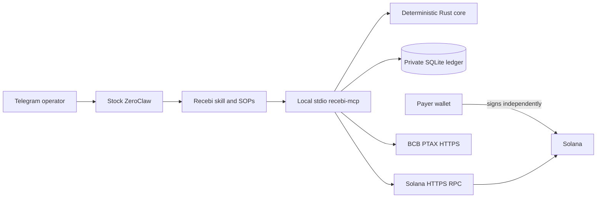

# Recebi

**Reference-bound USDC receivables for ZeroClaw, with deterministic Solana verification and Brazil-ready evidence.**

Recebi turns a private ZeroClaw agent into a non-custodial receivables operator. It creates Solana Pay requests, watches for payment, verifies the exact finalized SPL Token transfer in Rust, and produces local monthly evidence with official Banco Central do Brasil (BCB) PTAX provenance.

> **Project status:** the complete flow has been exercised through Telegram on self-operated Solana devnet. Mainnet operation, independent customer usage, and accountant acceptance are not claimed.

## The use case

A Brazilian freelancer or small studio needs more than a wallet notification. They need to know which invoice was paid, reject convincing but incorrect transfers, and retain evidence for month-end records.

From Telegram, the operator can:

```text
Create invoice ACME-412 for 0.10 USDC with public label Acme invoice
Check ACME-412
Snapshot 2026-08
Close 2026-07
```

Recebi returns a unique Solana Pay URL and QR. The customer signs in their own wallet. Recebi marks the invoice paid only after finalized chain evidence proves the configured recipient, classic SPL USDC mint, exact atomic amount, transfer-bound reference, successful execution, cluster, and replay uniqueness.

A finalized transfer with the correct reference but the wrong amount remains **unpaid** and moves to review.

## Why Recebi

| Problem | Recebi behavior |
|---|---|
| Chat says “I paid” | Chat is never payment evidence |
| Reference appears elsewhere in a transaction | The reference must be bound to the accepted transfer instruction |
| Wrong amount, mint, or recipient | The receivable remains unpaid |
| RPC or PTAX is unavailable | State remains unchanged or valuation becomes pending |
| A job retries after restart | Unique constraints and fingerprints prevent double counting |
| The model is prompted to refund or redirect funds | No signing, transfer, refund, or key capability exists |
| Month-end evidence is regenerated | Revisions and hashes preserve provenance |

## Custody boundary

Recebi combines **T1 Build** and **T0 Read** from the bounty custody ladder:

- **T1 Build:** creates an unsigned Solana Pay transfer-request URL and QR.
- **T0 Read:** reads finalized Solana and BCB evidence.
- **Never T2:** holds no private key, seed phrase, signer, session wallet, or transaction-submission capability.

The payer’s wallet remains the only signer. ZeroClaw and the LLM orchestrate bounded tools; deterministic Rust establishes payment state.

## Architecture



- [`recebi-core`](crates/recebi-core): domain types, Solana Pay construction, transaction decoding, settlement rules, and fixed-point PTAX policy.
- [`recebi-store`](crates/recebi-store): transactional SQLite state, replay protection, hash-chained events, checkpoints, and deterministic revisions.
- [`recebi-mcp`](apps/recebi-mcp): bounded MCP transport, network adapters, QR generation, reconciliation, and month close.
- [`zeroclaw`](zeroclaw): private skill, configuration examples, and operator SOPs.
- [`scripts`](scripts): validation, build, scheduler hardening, reconciliation, and review helpers.

See [Architecture](docs/ARCHITECTURE.md) for the complete data and control flow.

## Quick start

Requirements: Linux, Rust 1.91+, Cargo, stock ZeroClaw 0.8.3, Telegram configured in ZeroClaw, and an HTTPS Solana RPC endpoint.

```bash
git clone https://github.com/hicksonhaziel/Recebi.git
cd Recebi
./scripts/check.sh
./scripts/install.sh
```

The build helper creates `target/release/recebi-mcp`; it does not install a system-wide binary. Continue with [Installation](docs/INSTALLATION.md) to configure the trusted merchant, mint, cluster, private data directory, ZeroClaw MCP bundle, skill, and SOPs.

After configuration and a ZeroClaw restart, send `/new` in Telegram so the new session loads the MCP bundle.

## What is supported

| Area | Current scope |
|---|---|
| Network | Configured Solana cluster with pinned genesis identity |
| Asset | One configured classic SPL Token USDC mint |
| Merchant | One configured wallet and derived token account |
| Transactions | Legacy and bounded resolved v0 transactions |
| Monitoring | Three-minute deterministic hot window plus five-minute fallback |
| Review | Local operator flow with durable out-of-band approval |
| Valuation | Strict same-day official BCB PTAX sale quote |
| Exports | Canonical JSON, accountant CSV, and SHA-256 manifest |
| Channel | Telegram is the demonstrated operator channel |

Recebi does **not** implement PIX, swaps, refunds, signing, custody, Token-2022, split-payment aggregation, or overpayment acceptance. The BRL result is a nominal bookkeeping reference using the explicit assumption `1 USDC = 1 USD`; it is not fair-value proof, tax advice, legal advice, or a fiscal invoice. PTAX artifacts retain parsed same-day quote fields and a contemporaneous response digest, but not the raw BCB response bytes.

## Documentation

| Guide | Purpose |
|---|---|
| [Installation](docs/INSTALLATION.md) | Build, configure, connect ZeroClaw, and verify the deployment |
| [Architecture](docs/ARCHITECTURE.md) | Components, tool surface, state transitions, and scheduling |
| [Operations](docs/OPERATIONS.md) | Daily use, reconciliation, review, month close, backup, and recovery |
| [Threat model](docs/THREAT_MODEL.md) | Custody tier, trust boundaries, abuse cases, and residual risk |
| [Evidence](docs/EVIDENCE.md) | Dated self-operated devnet results and claim boundaries |
| [Showcase](docs/SHOWCASE.md) | Bounty write-up structure, video plan, and redaction checklist |
| [Security policy](SECURITY.md) | Security invariants and vulnerability reporting guidance |

## Validation

The default repository gate is:

```bash
./scripts/check.sh
```

It runs formatting checks, workspace Clippy with warnings denied, and workspace tests. Additional dependency and shell checks are documented in [Installation](docs/INSTALLATION.md#optional-supply-chain-and-shell-checks).

## Evidence, not claims

The operator log records real Telegram interactions, exact and wrong-amount finalized devnet transfers, idempotent reconciliation, PTAX outage behavior, durable approval denial/timeout/success, process restarts, automatic hot reconciliation, and four prompt-injection attacks with an unchanged material-ledger root. See [Evidence](docs/EVIDENCE.md).

For a bounty submission, the live video and showcase post remain the submission artifacts. Repository documentation is supporting reproducibility material, not a substitute for a running demonstration.

## License

Licensed under either [Apache License 2.0](LICENSE-APACHE) or [MIT](LICENSE-MIT), at your option.
