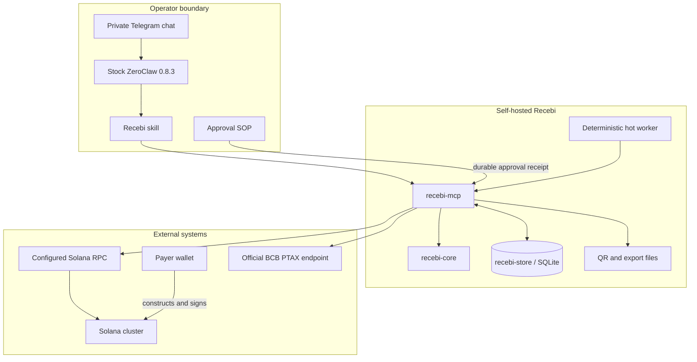
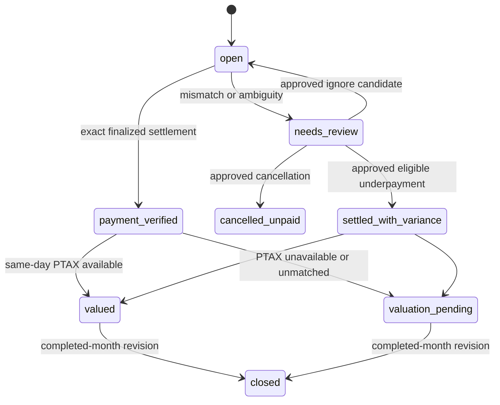

# Architecture

Recebi separates conversational orchestration from deterministic payment truth. ZeroClaw decides **when** to call a bounded operation; Rust decides **whether** chain evidence satisfies the receivable.

## System context



The payer wallet is outside Recebi. No signing key crosses the MCP boundary.

## Components

### `crates/recebi-core`

Pure domain logic for:

- bounded identifiers, labels, public keys, amounts, and references;
- canonical Solana Pay transfer-request URLs;
- legacy and resolved-v0 transaction decoding;
- classic SPL Token transfer verification;
- settlement verdicts and replay fingerprints;
- fixed-point PTAX selection and BRL derivation; and
- explicit provenance types.

The core performs no live network, filesystem, MCP, wallet, signer, or LLM operation.

### `crates/recebi-store`

Transactional SQLite persistence for:

- receivables and state transitions;
- append-only hash-chained events;
- settlements and replay constraints;
- review candidates and resolutions;
- PTAX valuations;
- notification outbox and delivery receipts;
- monthly close revisions;
- singleton and per-month leases; and
- material-ledger checkpoints.

State changes are atomic. Unique constraints and deterministic fingerprints make repeated reconciliation idempotent.

### `apps/recebi-mcp`

The runtime adapter owns:

- trusted local configuration loading;
- newline-delimited stdio MCP;
- bounded Solana and BCB HTTPS clients;
- QR rendering;
- reconciliation orchestration;
- monthly snapshot and close; and
- compact, structured model-facing responses.

MCP arguments cannot override the cluster, recipient, mint, RPC endpoint, data path, or PTAX policy.

### `zeroclaw`

ZeroClaw provides the operator channel and orchestration surface:

- a private Recebi skill maps narrow intents to MCP calls;
- a persistent SOP provides durable out-of-band approval receipts;
- cron runs bounded hot and background reconciliation; and
- Telegram delivers QR images, status messages, and accountant CSV files.

The LLM can explain results but cannot establish settlement or valuation truth.

## Module map

The two largest files are intentionally mapped here rather than refactored immediately before the showcase.

### `crates/recebi-store/src/lib.rs`

| Region | Responsibility |
|---|---|
| `ReceivableStore` API (`~120–1609`) | Connections, atomic creation/state transitions, replay checks, leases, notifications, valuation, review, and month-close writes |
| Integrity helpers (`~1612–1823`) | Event-chain verification, material-ledger verification, valuation lookup, and deterministic close hashing |
| Migrations/checkpoints (`~1832–2327`) | Schema upgrades, checkpoint initialization/appending/verification, ledger-root calculation, and owner-only file modes |
| Mapping and tests (`~2328–end`) | State migration, row decoding, canonical event encoding, concurrency, tamper, restart, and permission tests |

### `apps/recebi-mcp/src/reconcile.rs`

| Region | Responsibility |
|---|---|
| Tool contracts (`~33–200`) | Bounded inputs, statuses, outputs, notifications, and typed errors |
| Single-receivable flow (`~201–683`) | Live construction, check/watch windows, cluster validation, candidate loading, deterministic settlement, and fail-closed results |
| Operator and batch flow (`~684–1035`) | Review disposition, anomaly recording, bounded open/hot reconciliation, outbox acknowledgement, and PTAX status |
| Helpers and tests (`~1036–end`) | Time/format/error/fingerprint helpers plus mocked-RPC exact, mismatch, overlap, and malformed-evidence tests |

This map gives reviewers navigable boundaries while preserving the already-tested implementation.

## Layering choice

Recebi uses stock ZeroClaw plus a local stdio MCP, not a source-built WASM plugin. The use case is not a thin RPC wrapper: it needs SQLite/WAL persistence, append-only checkpoints, private QR/CSV/manifest files, atomic publication, local approval helpers, and OS-scheduled reconciliation. Those capabilities are not exposed together by the current plugin permission surface. Splitting only the pure verifier into WASM would leave the stateful trust boundary in a host service while adding another component boundary without reducing custody.

The deterministic core remains network- and filesystem-free, so it can be reused in another host later. For this T1 Build + T0 Read system, stdio MCP keeps the release host stock, the ledger local, the interfaces bounded, and all signing capability absent.

## Upstream friction and fail-closed adaptations

ZeroClaw 0.8.3 behavior shaped three implementation decisions:

1. A chat-local SOP engine could expose post-gate instructions before durable out-of-band approval completed. Recebi removed review mutation from discovery; the SOP now emits only a receipt, and a local helper verifies the completed run before invoking the internal mutation.
2. The cron CLI did not expose every delivery/hardening field needed by the deployment. Installer helpers validate exact job shapes, create mode-`0600` backups, and update only the required scheduler fields.
3. MCP discovery is session-scoped, so configuration changes require a fresh `/new` conversation. Channel references also use explicit dotted aliases such as `telegram.default`.

The remaining hot-worker single-flight limitation is disclosed below rather than hidden.

## Request and settlement flow

```mermaid
sequenceDiagram
    actor O as Operator
    participant Z as ZeroClaw
    participant M as recebi-mcp
    participant D as SQLite
    actor P as Payer wallet
    participant N as Solana

    O->>Z: Create invoice ID, amount, public label
    Z->>M: recebi_create_request
    M->>D: Persist ID + random reference + request
    M-->>Z: Solana Pay URL + QR marker
    Z-->>O: URL and QR
    P->>N: Build and sign transfer independently
    Z->>M: check / bounded reconcile
    M->>N: Finalized reference and transaction reads
    M->>M: Decode and verify in Rust
    alt Exact supported transfer
        M->>D: Atomic settlement + event + notification
        M-->>Z: payment_verified
    else Mismatch or ambiguity
        M->>D: Review candidate; no settlement
        M-->>Z: needs_review (still unpaid)
    else Incomplete evidence
        M-->>Z: incomplete; state unchanged
    end
```

### Acceptance predicate

A receivable becomes `payment_verified` only when one supported finalized transaction proves all of the following:

1. the configured Solana cluster identity;
2. successful transaction execution;
3. the configured classic SPL Token program and mint;
4. the merchant’s associated token account;
5. the exact atomic amount;
6. the receivable reference bound to that transfer instruction;
7. supported instruction and account shapes; and
8. unused signature/reference fingerprints.

Chat messages, transaction memos, payer claims, and model output are not inputs to this predicate.

## State model



`settled_with_variance` is deliberately distinct from `payment_verified`. It preserves expected, received, and shortfall amounts, the candidate fingerprint, the approval receipt, and a bounded business reason.

## MCP tool surface

Nine tools are returned by `tools/list`:

| Tool | Purpose | Chat-controlled inputs |
|---|---|---|
| `recebi_health` | Validate local config and data access | None |
| `recebi_create_request` | Create or return a durable request | ID, amount, public label |
| `recebi_render_qr` | Render the persisted request URL | ID |
| `recebi_check` | Check one receivable | ID |
| `recebi_watch_payment` | One bounded manual watch window | ID, window `1..4` |
| `recebi_hot_reconcile` | Reconcile recently created invoices | None |
| `recebi_reconcile_open` | Reconcile a bounded open batch | Maximum count `1..10` |
| `recebi_snapshot_month` | Produce a provisional month snapshot | `YYYY-MM` |
| `recebi_close_month` | Finalize a completed UTC month | `YYYY-MM` |

Two operations can be dispatched internally but are intentionally absent from discovery:

- notification acknowledgement, used after deterministic Telegram delivery succeeds;
- review resolution, used by the local receipt-verifying helper.

Non-discovery protects the normal model-facing surface; it is not authorization for arbitrary stdio clients. A caller with direct access to the MCP process is privileged. The review service rechecks candidate state, fingerprint, action, and amounts, but the ZeroClaw SOP receipt itself is verified by `scripts/review.sh` and `scripts/resolve-review.sh`, not by `recebi-mcp`. Production permissions must prevent untrusted direct invocation.

Some QR and CSV results contain absolute private paths, including attachment markers required by ZeroClaw. The skill instructs the agent not to repeat ordinary path fields, and stock ZeroClaw removes markers before Telegram delivery. The model still receives those paths, so ZeroClaw is inside the confidentiality boundary and operators must verify marker stripping end to end.

There is no operation for signing, submitting, refunding, swapping, changing trusted configuration, or accepting an arbitrary transaction as exact payment.

The binary also accepts `--verify-ledger`, which verifies the event chain, material-table root, and checkpoint chain offline and exits. It is a local operator command, not an MCP tool: it opens no server, makes no network call, mutates no state, and is unreachable from chat. `scripts/restore-drill.sh` uses it to prove a restored backup is cryptographically identical to the live ledger.

## Reconciliation architecture

Recebi uses polling, matching the bounty’s recommended channel-resident architecture.

### Hot path

- ZeroClaw keeps a lightweight shell watchdog scheduled every second.
- With no recent open invoice, the worker performs one bounded pass and exits.
- With a recent invoice, the worker checks at monotonic five-second deadlines for at most three minutes.
- No LLM participates in the polling, evidence verification, response shaping, or Telegram delivery path.
- Terminal notifications remain in a durable outbox until delivery succeeds and a receipt is recorded.

The worker has no process-lifetime lock. SQLite leases serialize individual reconciliation passes, not sleeping shell processes. The one-second schedule is safe only if the deployed ZeroClaw scheduler prevents overlapping executions of the same job; that behavior has not been established by this repository. Operators must verify single-flight behavior or leave the hot watchdog disabled and rely on the bounded background pass until an external process lock is added.

### Background path

- A ZeroClaw agent job runs every five minutes.
- Memory is disabled.
- Only `recebi__recebi_reconcile_open` is allowed.
- At most ten records are checked per pass.
- It recovers older invoices and retries undelivered terminal records.

The hot path is a latency optimization; the background path is the durable fallback.

## PTAX and monthly evidence

Payment truth and BRL valuation are independent:

1. settlement is first established from finalized Solana evidence;
2. a settled receivable requests the official BCB `CotacaoDolarDia` source at check time, and snapshot or close requests it for anything still unvalued;
3. only a same-day quote is accepted;
4. parsed quote fields and the contemporaneous response SHA-256 are retained;
5. fixed-point arithmetic derives the nominal BRL reference; and
6. JSON, CSV, and a hash manifest are published atomically.

Valuation at check time is strictly additive and fail-open: an unpublished quote, a source outage, or a malformed response leaves the receivable settled and unvalued, never changes payment state, and never overwrites an existing valuation. Because BCB publishes the closing quote on business days only, after the market closes, a payment is normally valued on a later check the same day. Weekend and holiday payments never receive a same-day quote and remain `valuation_pending` by policy.

The official endpoint carries its own timeout and a bounded transport retry, separate from the Solana RPC bound, because a cold TLS connection to BCB can be materially slower than an RPC call. Only transport failures are retried; a non-success status, an oversized body, or a malformed payload fails closed immediately.

The bounded raw BCB response bytes are not retained. The artifacts reproduce the calculation and record the digest, but they are not a self-contained archive from which the exact source response can later be reconstructed or independently rehashed.

If the endpoint is unavailable or the date does not match, payment remains verified and valuation becomes `valuation_pending`. There is no weekend or nearest-day substitution.

## Bounds and failure semantics

RPC calls have deadlines, response-size caps, candidate limits, and no redirect following. MCP input/output, labels, IDs, account keys, instructions, reconciliation batches, and anomaly samples are bounded.

| Failure | Result |
|---|---|
| malformed or oversized RPC data | `incomplete`; payment state unchanged |
| unsupported transaction shape | rejected or review; never inferred paid |
| concurrent reconciliation pass | SQLite lease rejects simultaneous state work |
| overlapping hot workers | not prevented at process lifetime; deployment must provide single-flight |
| repeated finalized candidate | idempotent result |
| crash during SQLite mutation | transaction rollback |
| crash during export | atomic publication prevents partial canonical output |
| ledger modification | checkpoint verification fails |
| PTAX outage | payment preserved; valuation pending |

## Design constraints

- One configured merchant and classic SPL mint keep the trust boundary inspectable.
- Polling avoids requiring public webhook ingress.
- Compact tool results protect the model context from raw RPC payloads.
- The local stdio MCP keeps deterministic code self-hosted without a third-party signing service.
- The implementation is native Rust, not a WASM plugin, because the use case needs a local durable service and no in-agent key capability.
